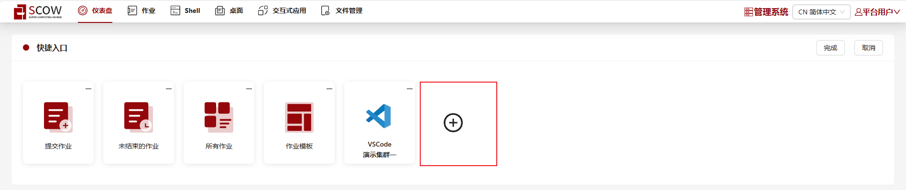
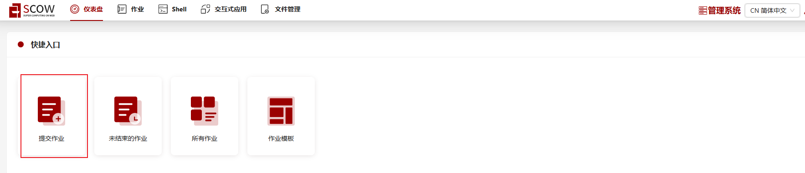
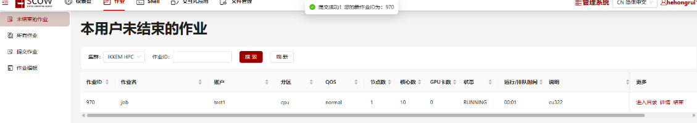
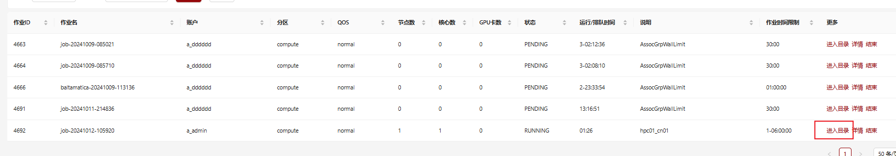
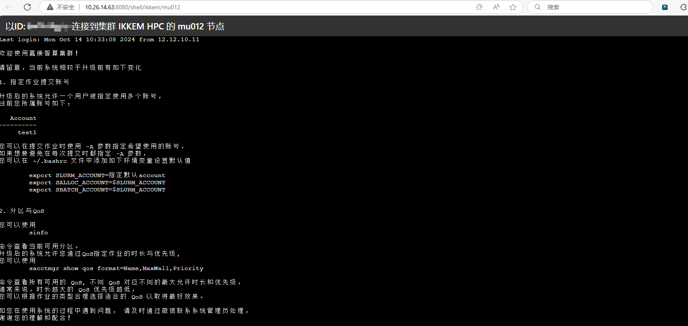
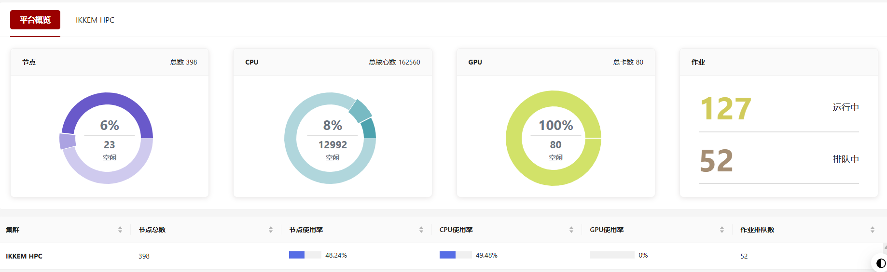
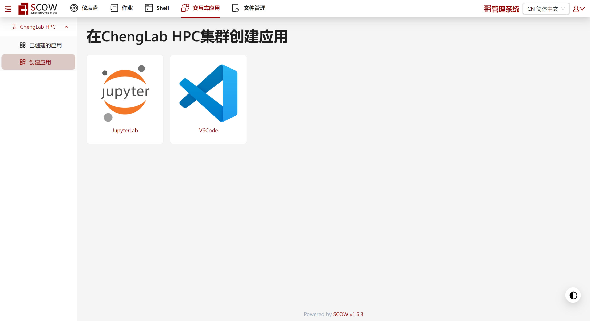
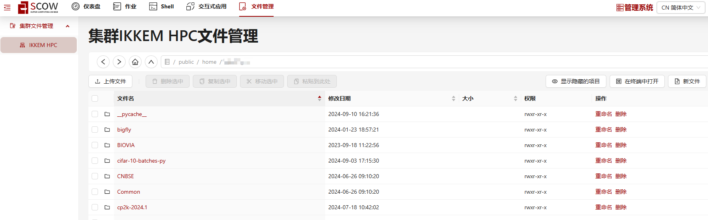

# OpenSCOW/Open Ondemand 使用说明

## 介绍

为方便在HPC集群上执行一些交互类应用，我们在 ChengLab HPC 集群的 `mgt02` 节点部署了
OpenSCOW 超算门户和 Open Ondemand (OOD) 实例。使用该服务可参考以下步骤。

## 前置准备

### 设置用户密码

由于 SCOW 和 OOD 均使用 PAM 认证，因此需要为登录用户设置相应的密码。目前新增用户的密码已经采用随机密码，老用户请联系管理员获取或重置密码。
验证步骤：

- 登录到 `mgt02` 节点
- 执行 `passwd` 设置用户密码，如密码未知可找管理员获取或重置
- 执行 `pamtester sshd $(whoami) authenticate` 测试密码是否生效，如遇问题请等待1分钟后重试，遇问题可找管理员处理

## OpenSCOW

该实例包含一套交互式作业提交入口和 Jupyter、VS Code 应用入口，未来可根据需要部署更多应用。

请在内网访问 [http://172.27.127.191:8081](http://172.27.127.191:8081) 即可使用，注意用户名和密码参照上方的指引配置。

> 以下部分引用自嘉庚智算用户手册

### 主界面介绍

- 仪表盘：分为两个部分，快捷入口和平台概览
- 快捷入口点击后面的+号可以自定义需要导入的模块，例如可以添加按钮快速在集群上提交 VSCode 作业
   
- 网页端可提交作业至集群
  - 进入 SCOW 平台后，点击提交作业
    
  - 需填写命令、分区、QOS、节点数、单节点核心数、最长运行时间，确认无误后可点击下面提交按钮（也可以提交时选择保存为模板，方便同类型作业提交）
    
- 如没有报错，提交后会跳转到未结束的作业模块（可以同时选上作业模板，方便同类型作业提交），提交成功和作业ID
    
- 点击作业中的进入目录，可以看到作业标准/错误输出文件，支持下载、重命名、删除、提交
    
- 集群命令行界面登录：从 Shell 模块中可进入到命令行界面
    
    
- 作业模板：可保存之前提交过的作业脚本
    
- 支持查看本用户所有历史作业，可按批量搜索（按集群）、精确搜索（按集群+作业 ID）
    
- 平台概览：包括集群 CPU、GPU 空闲可用节点，作业排队情况等
    
- 交互式应用模块
  - 用户可以在此使用平台提供的交互式应用，并提交到集群作业管理系统上，如 Jupyter、 VS Code 等。
		
 - 例如提交 Jupyter Lab 作业，则点击上图中 JupyterLab 的按钮，然后配置所需的作业参数
		
	如图所示，这种情况则用户提交作业，在自己用户下的 `local` 环境中创建 Jupyter 作业，并在加载 conda 环境前加载 `cuda/11.8` 环境。该作业将被提交到 `gpu3` 队列中，使用 `normal` 优先级，申请 1 个节点上 4 个 CPU 核及 1 张 GPU 卡，申请 8 GB 内存资源。 
- 文件管理模块：在网页端可以对自己目录下的文件进行增删改
	
更详细的使用说明请参考[官方文档](https://pkuhpc.github.io/OpenSCOW/docs/info)。

## Open Ondemand

该实例包含一个Jupyter应用入口，未来可根据需要部署更多应用。

### 设置ssh转发配置

该 OOD 部署于 `mgt02` 80端口, 访问需通过 ssh 转发。由于应用限制，本地转发端口必需设置为 8086。参考命令如下

```bash
ssh -v -N -L 8086:localhost:80 cheng-hpc
```

由于 `mgt02` 节点位于跳板机后，为便于访问可在个人电脑的 `~/.ssh/config` 中配置以下内容, 注意替换 YOUR_NAME 为自己的登录名。

```
Host cheng-hpc
    Hostname 172.27.127.191
    User YOUR_NAME
    Port 6666
```

### 使用

在确保ssh转发正常工作后，在浏览器访问 http://localhost:8086 即可使用该服务。

#### Jupyter

为正常使用 Jupyter, 需要在集群中通过 conda 进行安装，如果已有可忽略。具体步骤如下：

- 登录 `login01` or `mgt02`
- `module load miniconda/3` 
- `source activate <env> && pip install jupyterlab` # 如果使用 `<env>` 环境可使用此语句加载并安装
- `conda create -n <env> python=3.9 jupyterlab` # 创建一个名为 jupyter 的新环境并安装 Jupyter lab（以上操作二选一）
- `source activate <env>` # 载入刚刚安装的环境
- `pip install nbconvert==6.4.3` # workaound 一个bug... 未来或可不用

通过界面上的 Interactive Apps => Jupyter 即可打开启动界面。里面多数选项可保持默认，唯一需要填写的是 Jupyter 所在的 conda 环境（默认为 `base`, 如 Jupyter 位于其它环境请选择其它文件名），以及用户名（填写登录用户名即可）。

提交作业后会进入 Session 界面，在该界面可以看到提交作业的状态。当启动完毕后会出现 `connect to jupyter` ，点击即可使用。

## 常用技巧

### 转化 Jupyter Notebook 为 Python 脚本

```bash
ipython nbconvert --to script *.ipynb
```
