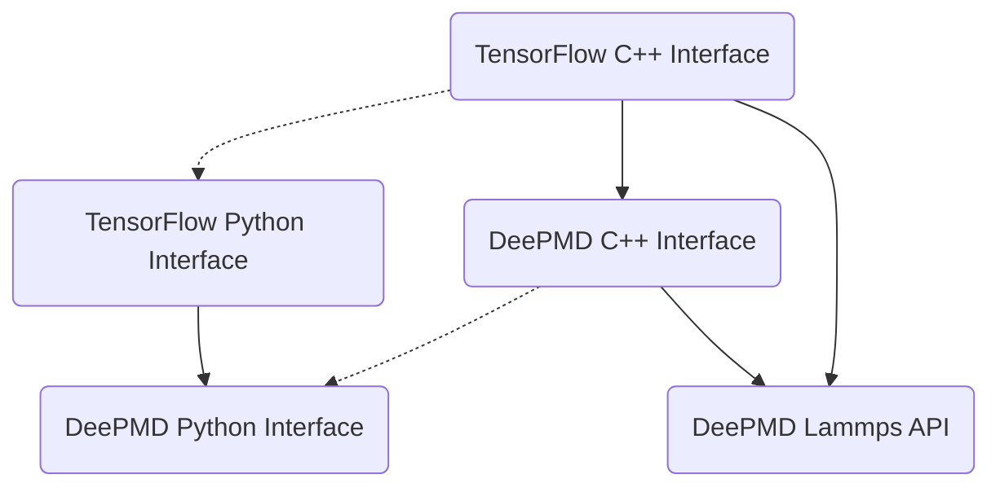

# DeepMD-kit安装最佳实践

背景：以 Zeus 集群为例，在服务器通过源代码编译安装DeepMD-kit和包含完整接口的LAMMPS。虽然官方已经提供了[通过 Conda 一键安装的方法](https://deepmd.readthedocs.io/en/master/install.html#easy-installation-methods)，但由于此法所安装的各个组件均为预编译版本，因而针对课题实际情况无法做更多拓展和改动，且通过 Conda 安装的 Protobuf 存在版本冲突，无法进一步编译其他接口。这里介绍一种方法，通过 Conda 安装通常不需要改动的TensorFlow C++ Interface，其余部分仍手动编译。由于目前新版Lammps已经提供Plugin支持，DeePMD亦支持通过Plugin调用，故可令组件之间相互解耦、减少后续安装的工序。

## 初始环境说明

以下过程以 Zeus 集群为例，操作系统及版本为CentOS 7，管理节点联网，采用module作为环境管理。

以下是预先配置好的环境，对于其他集群，可以此要求准备环境，其中 Intel MPI 可以用 MPICH 代替，其余组件请自行安装。注意CUDA 11.3对Nvidia驱动版本有要求，需要预先检查好（可用`nvidia-smi`快速查看）。

- 通过yum安装
  - Git >= 1.8.2
- 通过module加载
  - CUDA 11.3
  - Miniconda 3
  - GCC >= 7.4.0
  - Intel MPI 2017 （暂未对其他版本进行测试）

> 版本号仅供参考，实际安装因人而异，参考执行即可。

## DeePMD-kit 常用组件关系



如图所示展示了DeePMD-kit各个常用组件之间的联系，需要声明的是，图示并非对代码的严谨解析，仅仅是对组织结构的直观表现。

势函数训练过程通常依赖于DeePMD Python Interface，这一部分在用 Pip 安装时即依赖于TensorFlow的Python Interface，因此在图中用实线箭头表示。而用Pip安装的TensorFlow Wheel已经预先编译了底层所需的Tensorflow C++ Interface，这一隐含的依赖用虚线箭头表示。类似地，DeePMD-kit在Pip安装时也会调用CMake来编译一部分所需的C++库，因而也存在类似的关系。

当用训练好的势函数来进行MD模拟时，则需要运行Lammps等分子动力学软件调用DeePMD-kit接口。以Lammps为例，现有的两种方式分别是：
  - 在Lammps安装时即额外编译DeePMD API（即`USER-DEEPMD`）
  - 编译DeePMD Plugin，由支持Plugin的Lammps版本调用

这两种方式在编译时均需要调用DeePMD-kit和TensorFlow的C++ Interface，故在图中也用实线表示。而TensorFlow C++ Interface实际上可由源代码结合必要的底层依赖（如GCC、CUDA等）独立编译，DeePMD-kit C++ Interface只需在TensorFlow C++ Interface基础上进行编译（图中实线箭头）。

因而在实际处理安装关系时，我们也可以采用相对独立的编译方式来最大化解耦组件。下文的思路将按以下步骤展开：

   1. 建立独立的Conda环境，用 Pip 安装 TensorFlow 和 DeePMD-kit，提供势函数训练功能；
   2. 结合必要的组件、环境等编译Lammps，提供经典分子动力学模拟功能；
   3. 编译 DeePMD C++ Interface，在此基础上编译 DeePMD-kit Lammps Plugin供Lammps调用，提供 DeePMD 模拟功能；
   4. 编译 DeePMD CP2K API 和对应的CP2K版本（No free lunch.）

## 安装DeePMD-kit Python Interface

### 创建新的环境

首先准备必要的依赖。

检查可用的模块，并加载必要的模块：

```
module avail
module add cuda/11.3
module add gcc/7.4.0
```

注意这里导入的是GCC 7.4.0版本，如果采用低于4.9.4的版本（不导入GCC）则dp_ipi不会被编译。

然后创建虚拟环境，步骤请参考[Anaconda 使用指南](../cluster_usage/conda.md)。

假设创建的虚拟环境名称是 `deepmd`，则请将步骤最后的 `<your env name>` 替换为 `deepmd`。若采用该步骤的设置，则虚拟环境将被创建在`/data/user/conda/env/deepmd`下（假设用户名为`user`）。

```bash
conda create -n deepmd python=3.9
conda activate deepmd
```

注意请务必为创建的虚拟环境安装所需的Python环境。通常不指定Python版本号的情况下（例如文中的步骤`conda create -n <your env name> python`）会安装Conda推荐的最新版本，如需要替代请对应指定，如`conda create -n deepmd python=3.10`。

对于无法联网的节点，在编译时需要将所需的驱动程序库的符号库`libcuda.so`以`libcuda.so.1`的名称手动链接到某个具有权限的路径`/some/local/path`并分别加入环境变量，以通过编译流程：

```bash
ln -s /data/share/apps/cuda/11.3/lib64/stubs/libcuda.so /some/local/path/libcuda.so.1
export LD_LIBRARY_PATH=$LD_LIBRARY_PATH:/data/share/apps/cuda/11.3/lib64/stubs:/some/local/path
```

!!! tip "提示"
    若在Zeus 集群上安装，管理员已事先把<code>libcuda.so.1</code> 链接在<code>/data/share/apps/cuda/11.3/lib64/stubs/</code>下，故无需额外创建软链接，同理<code>/some/local/path</code>也无需加入环境变量，但仍需要驱动程序库的符号链接`libcuda.so`。注意这一步骤执行后，实际运行时需要从环境变量中移除

## 安装DeePMD-kit的Python接口

以防万一可以升级下pip的版本：

```
pip install --upgrade pip
```

接下来安装Tensorflow的Python接口

```bash
pip install tensorflow
```

 若提示已安装，请使用`--upgrade`选项进行覆盖安装。若提示权限不足，请使用`--user`选项在当前账号下安装。

然后下载DeePMD-kit的源代码（注意把`v2.1.5`替换为需要安装的版本，如`v2.0.3`等）

```bash
cd /some/workspace
git clone --recursive https://github.com/deepmodeling/deepmd-kit.git deepmd-kit -b v2.1.5
```

在运行git clone时记得要`--recursive`，这样才可以将全部文件正确下载下来，否则在编译过程中会报错。

!!! tip "提示"
    如果不慎漏了`--recursive`， 可以采取以下的补救方法：
    ```bash
    git submodule update --init --recursive
    ```

若集群上 CMake 3没有安装，可以用pip进行安装：

```bash
pip install cmake
```

修改环境变量以使得cmake正确指定编译器：

```bash
export CC=`which gcc`
export CXX=`which g++`
export FC=`which gfortran`
```

若要启用CUDA编译，请导入环境变量：

```bash
export DP_VARIANT=cuda
```

随后通过pip安装DeePMD-kit：

```bash
cd deepmd-kit
pip install .
```

## 安装Lammps

注意这一部分可以从DeePMD安装中解耦出来，因而兼顾对Lammps的不同需求，而不必为DeePMD专门编译一个Lammps可执行文件。

### 环境准备

首先加载所需的环境，包括CMake、Intel MPI等。若不需要编译Lammps原生的GPU加速，可不需要加载CUDA环境。注意需要把Intel MPI提供的头文件（`mpi.h`等）所在路径加入`C_INCLUDE_PATH`中。

仍以Zeus为例，如下所示。注意这里使用的是全局的CMake，如果与上一部分采用同一个环境，可不需重复加载。

```bash
module load cmake/3.20
module load intel/17.5.239 mpi/intel/2017.5.239 gcc/7.4.0
# if not included
export C_INCLUDE_PATH=<intel_installation_dir>/impi/2017.4.239/include64:$C_INCLUDE_PATH
```

若需要编译对应的Lammps组件（如Plumed、NetCDF等），请对应加载所需的环境：

```bash
module load netcdf/4.9.0_intel17
module load plumed
```

如需编译Lammps原生的GPU加速，可加载CUDA环境，注意这会使得编译得到的Lammps无法在不包括GPU的节点上运行。

```bash
# gpu acceleration support
module load cuda/11.3
```

!!! warning
    若编译Lammps原生的GPU加速，请注意原生默认采用半精度。Lammps在开启GPU加速时速度可有较大提升，但精度问题已知可能导致DeePMD势函数模拟误差上升（体现为Model Deviation相比不开启GPU加速显著上升），请针对体系做测试确认误差是否符合预期。DeePMD接口官方未提供Lammps的GPU加速支持，且默认编译的是双精度版本，请务必注意。

### 配置编译

创建文件夹

```bash
cd <lammps_source_code>
mkdir build
cd build
```

进行编译

```bash
cmake  -DCMAKE_C_COMPILER=gcc -DCMAKE_CXX_COMPILER=g++ \
-DCMAKE_Fortran_COMPILER=gfortran \
-D BUILD_MPI=yes -D BUILD_OMP=yes -D LAMMPS_MACHINE=mpi \
-D BUILD_SHARED_LIBS=yes \
-D CMAKE_INSTALL_PREFIX=<lammps_installation_dir> \
-D CMAKE_INSTALL_LIBDIR=lib \
-D CMAKE_INSTALL_FULL_LIBDIR=<lammps_installation_dir>/lib \
-C ../cmake/presets/most.cmake -C ../cmake/presets/nolib.cmake ../cmake
```

`CMAKE_INSTALL_PREFIX` 可以根据安装实际路径修改，但这一方法得到的是共享库（ `*.so` ），所以包括Lammps源代码在内都不要移动。

若开启对应插件，请注意在 `../cmake` 前插入对应选项，如：

```
-D PKG_PLUMED=yes -D PLUMED_MODE=shared \
-D PKG_H5MD=yes -D PKG_NETCDF=yes \
-D NETCDF_INCLUDE_DIR=<netcdf_installation_dir>/include 
```

若希望开启GPU加速，请增加选项：

```bash
-D PKG_GPU=on -D GPU_API=cuda
```

### 开始编译
运行

```bash
make
make install
```

## 编译DeePMD-kit Lammps Plugin

### 方法一：静态编译

#### 安装Tensorflow的C++ 接口

以下安装，假设软件包下载路径均为 `/some/workspace`， 以 TensorFlow 2.7.0版本、DeePMD-kit 2.1.5 版本为例进行说明，其他版本的步骤请参照修改。注意为保证模型兼容性，版本号最好与 Python Interface对应。

本步骤需要使用 Conda，因此在[前文基础上](#安装deepmd-kit-python-interface)进行。

搜索仓库，查找可用的 TensorFlow 的 C++ 接口版本。

```bash
conda search libtensorflow_cc -c https://conda.deepmodeling.com
```

结果如下：

```
Loading channels: done
# Name                       Version           Build  Channel
libtensorflow_cc              1.14.0  cpu_h9a2eada_0
libtensorflow_cc              1.14.0  gpu_he292aa2_0
libtensorflow_cc               2.0.0  cpu_h9a2eada_0
libtensorflow_cc               2.0.0  gpu_he292aa2_0
libtensorflow_cc               2.1.0  cpu_cudaNone_0
libtensorflow_cc               2.1.0  gpu_cuda10.0_0
libtensorflow_cc               2.1.0  gpu_cuda10.1_0
libtensorflow_cc               2.1.0   gpu_cuda9.2_0
libtensorflow_cc               2.3.0  cpu_cudaNone_0
libtensorflow_cc               2.3.0  gpu_cuda10.1_0
libtensorflow_cc               2.4.1  gpu_cuda11.0_0
libtensorflow_cc               2.4.1  gpu_cuda11.1_0
libtensorflow_cc               2.5.0  cpu_cudaNone_0
libtensorflow_cc               2.5.0  gpu_cuda10.1_0
libtensorflow_cc               2.5.0  gpu_cuda11.3_0
libtensorflow_cc               2.7.0  cpu_h6ddf1b9_0
libtensorflow_cc               2.7.0 cuda101h50fd26c_0
libtensorflow_cc               2.7.0 cuda113h3372e5c_0
libtensorflow_cc               2.7.0 cuda113hbf71e95_1
libtensorflow_cc               2.9.0  cpu_h681ccd4_0
libtensorflow_cc               2.9.0 cuda102h929c028_0
libtensorflow_cc               2.9.0 cuda116h4bf587c_0
```

这里所希望安装的版本是2.7.0的GPU版本，CUDA版本为11.3，因此输入以下命令安装：

```bash
conda install libtensorflow_cc=2.7.0=cuda113hbf71e95_1 -c https://conda.deepmodeling.com
```

若所安装的环境没有实际的GPU驱动（比如集群的登录节点）或需要用到Conda安装CudaToolkit，可能需要参照[此处](https://conda-forge.org/docs/user/tipsandtricks.html#installing-cuda-enabled-packages-like-tensorflow-and-pytorch)说明强制指定GPU环境。比如：

```bash
CONDA_OVERRIDE_CUDA="11.3" conda install libtensorflow_cc=2.7.0=cuda113hbf71e95_1 -c https://conda.deepmodeling.com
```

请注意 `CONDA_OVERRIDE_CUDA` 的值需要与GPU支持以及希望用到的CUDA版本相匹配。

!!! tip "提示"
    注意A100仅支持TF 2.4.0以上、CUDA11.2以上，安装时请对应选择。

!!! tip "提示"
    个别版本在后续编译时可能会提示需要<code>libiomp5.so</code>，请根据实际情况确定是否需要载入Intel环境或者<code>conda install intel-openmp</code>。

!!! tip "提示"
    <code>conda</code>命令可能速度较慢，也可以考虑切换为<a href='https://mamba.readthedocs.io/en/latest/installation.html#existing-conda-install'>mamba</a>，后者可大幅加速Conda的性能，且完全兼容。只需参照前述链接安装后将<code>conda</code>替换为<code>mamba</code>即可

若成功安装，则定义环境变量：

```bash
export tensorflow_root=/data/user/conda/env/deepmd
```

即虚拟环境创建的路径。后文将使用 `$tensorflow_root` 来指定该路径。

#### 安装DeePMD-kit的C++ 接口

下面开始编译DeePMD-kit C++接口：

```bash
deepmd_source_dir=`pwd`
cd $deepmd_source_dir/source
mkdir build 
cd build
```

假设DeePMD-kit C++ 接口安装在 `/some/workspace/deepmd_root` 下，定义安装路径 `deepmd_root`：

```bash
export deepmd_root=/some/workspace/deepmd_root
```

在build目录下运行：

```bash
cmake -DLAMMPS_SOURCE_ROOT=<lammps_source_code> \
-DTENSORFLOW_ROOT=$tensorflow_root -DCMAKE_INSTALL_PREFIX=$deepmd_root \
-DUSE_CUDA_TOOLKIT=TRUE ..
```

注意这里的 `<lammps_source_code>` 对应[前文中](#安装lammps)Lammps的源码路径。

最后编译并安装：

```bash
make
make install
```

若无报错，通过以下命令执行检查是否有正确输出：

```bash
$ ls $deepmd_root/lib
deepmd_lmp/           libdeepmd_cc_low.so   libdeepmd_gromacs.so  libdeepmd_ipi.so      libdeepmd_lmp.so      libdeepmd_op.so
deepmd_lmp_low/       libdeepmd_cc.so       libdeepmd_ipi_low.so  libdeepmd_lmp_low.so  libdeepmd_op_cuda.so  libdeepmd.so
```

注意应当包含`deepmd_lmp/`和`libdeepmd_lmp.so`，后两者即为Lammps插件的位置。

### 方法二：采用TensorFlow Python 版本的库

从 DeePMD-kit v2.2 起，`cmake` 支持设置 `-DUSE_TF_PYTHON_LIBS=TRUE`的方式，从而免去了安装 `libtensorflow_cc` 的麻烦。

```bash
cmake -DLAMMPS_SOURCE_ROOT=<lammps_source_code> \
-DUSE_TF_PYTHON_LIBS=TRUE -DUSE_CUDA_TOOLKIT=TRUE \
-DCMAKE_INSTALL_PREFIX=$deepmd_root ..
```

!!! tip 提示
    请注意，这种方法采用Python Wheel提供的 `libtensorflow_framework.so.2` 和 `_pywrap_tensorflow_internal.so` （作为 `libtensorflow_cc.so`的替代）进行编译。
    后者依赖 Python 库 `libpython3.*.so.*`（因版本不同而异），请注意基于上述库的编译应保证后者路径也在 `LD_LIBRARY_PATH` 中。

为使得编译好的库文件可以更容易找到上述依赖，请执行以下操作，建立一个伪 `tensorflow_root` 目录，假设该路径位于 `/some/workspace/tensorflow_root` 下，同时假设 Conda 环境仍位于 `/data/user/conda/env/deepmd` 下：

```bash
export tensorflow_root=/some/workspace/tensorflow_root
mkdir -p $tensorflow_root/lib 
cd $tensorflow
ln -s /data/user/conda/env/deepmd/lib/python3.10/site-packages/tensorflow/include .
cd lib
ln -s /data/user/conda/env/deepmd/lib/python3.10/site-packages/tensorflow/python/_pywrap_tensorflow_internal.so libtensorflow_cc.so
ln -s /data/user/conda/env/deepmd/lib/python3.10/site-packages/tensorflow/libtensorflow_framework.so.2 .
ln -s libtensorflow_framework.so.2 libtensorflow_framework.so
```

于是，我们便构建了一个伪 `tensorflow_root` 目录。注意后文的 `$tensorflow_root` 此时应指向该路径。

### 调用方法

使用前请加载好环境变量。注意若未定义 `$deepmd_root`、`$tensorflow_root`，请补全为完整路径。这里的 `/data/user/conda/env/deepmd` 仍是 Conda 环境的路径，请相应替换。

```bash
export LD_LIBRARY_PATH=$tensorflow_root/lib:$deepmd_root/lib:/data/user/conda/env/deepmd/lib:$LD_LIBRARY_PATH
export LAMMPS_PLUGIN_PATH=$deepmd_root/lib/deepmd_lmp
```

Lammps便会自动寻找插件并加载，从而可以实现DeePMD的支持。

```
pair_style      deepmd ../graph.pb
pair_coeff      * *
```

若无法自动找到，也可以手动在 **输入文件** 中加载，写在 `pair_style` 上一行即可，**注意 `$deepmd_root`、`$tensorflow_root` 须替换为完整路径**。

```
plugin load     $deepmd_root/lib/libdeepmd_lmp.so
pair_style      deepmd ../graph.pb
pair_coeff      * *
```

运行命令仍然是 `lmp_mpi -i <input_file>`。

## DP-CP2K 安装指引

首先clone对应的安装包：

```bash
git clone https://github.com/Cloudac7/cp2k.git -b deepmd_latest --recursive --depth=1
```

然后运行相应的Toolchain脚本：

```bash
cd tools/toolchain/
./install_cp2k_toolchain.sh --enable-cuda=no --with-deepmd=$deepmd_root --with-tfcc=$tensorflow_root --deepmd-mode=cuda --mpi-mode=no --with-libint=no --with-libxc=no --with-libxsmm=no
```

根据脚本运行结尾的提示复制arch文件并source所需的环境变量。

若上文中采用方法二编译了 DeePMD-kit 的 C++ Interface，请编辑 `arch/local.ssmp`，在 `LDFLAGS` 末尾增加如下字段：
```
-Wl,-rpath='/data/user/conda/env/deepmd/lib'
```

这里的目的是让编译时可以正确链接 `libpython3.*.so.*`，因而 `/data/user/conda/env/deepmd/` 仍旧是 Conda 环境路径。

最后回到主目录进行编译：

```bash
make -j 4 ARCH=local VERSION="ssmp sdbg"
```

编译正确完成后，可执行文件生成在 `exe/` 下，即 `cp2k.sopt`。

> 注意目前DP-CP2K暂未支持MPI，因而请单独编译此Serial版本。且CP2K由于IO问题，性能相比Lammps低50%以上，如非刚需还是建议使用Lammps进行MD模拟，后者可提供更多特性和加速的支持。
> 
> 同时目前开发者遇到一些困难，故提交的PR尚未更新且由于沉默过久已被官方关闭。如读者有在CP2K实现共享状态的开发经验，请联系作者，谢谢。
> 
> Now there is some difficulty in implemetion of shared state in CP2K run to decrease IO in each MD step. However, the developer has not find out a proper way as a solution, making the PR silent. If you could provide any experience, please contact me. Thanks!
